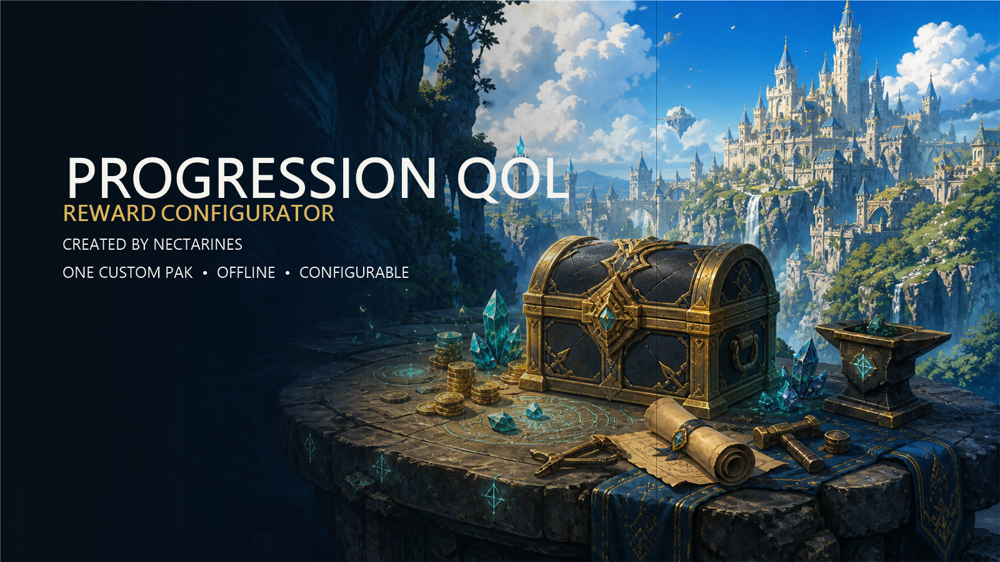
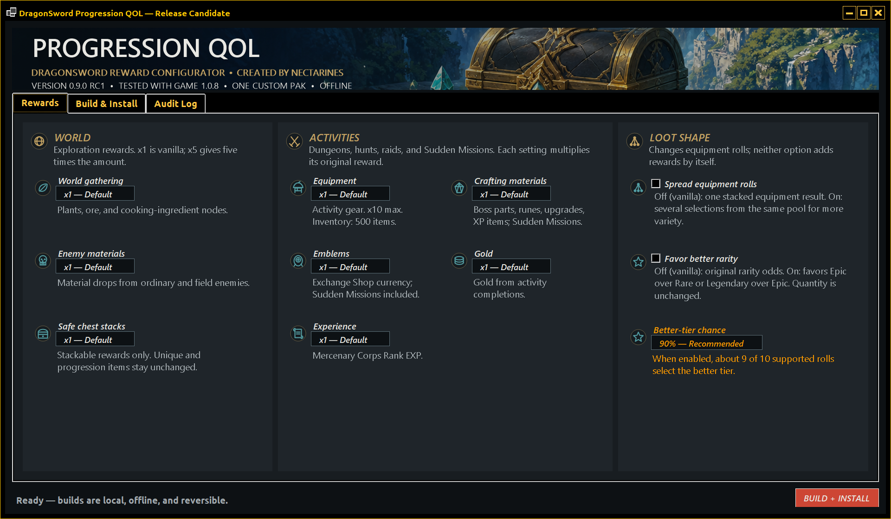
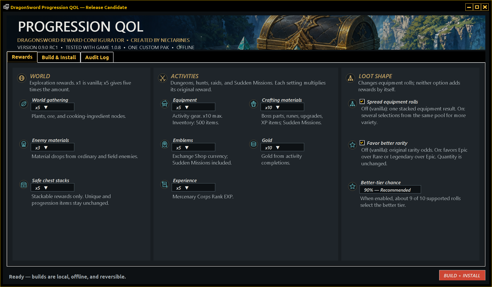
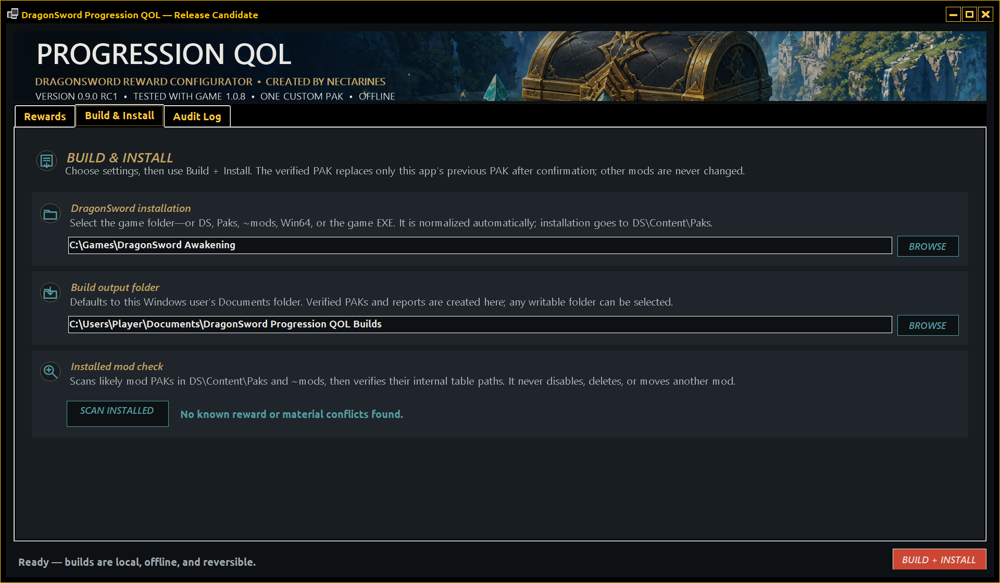
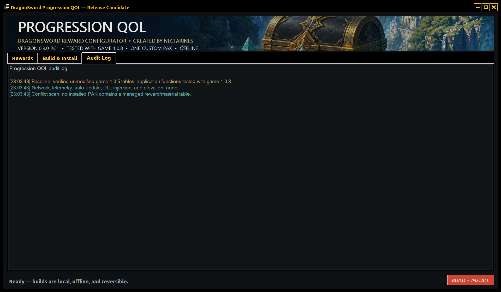

# DragonSword Progression QOL



An offline reward configurator for **DragonSword: Awakening**, created by **nectarines**.

Version `0.9.0-rc.1` is a public release candidate tested with game version 1.0.8. It builds one custom Unreal PAK from independently maintained targets and unmodified game-table baselines. Every multiplier starts at vanilla `x1`; both optional loot-shape features start off.

Download the current application from [GitHub Releases](https://github.com/Nectarines-NAL/DragonSword-Progression-QOL/releases). Do not download the automatically generated GitHub source archive as the runnable application.

## Features

- World gathering and ordinary enemy materials: x1–x20.
- Safe stackable world-chest rewards: x1–x10. Known unique and progression rewards remain unchanged.
- Dungeon, hunt, raid, and Sudden Mission equipment, crafting materials, Adventurer's Emblems, gold, and Mercenary Corps Rank EXP.
- Equipment is capped at x10 because the equipment inventory holds 500 items.
- Optional Spread Equipment Rolls turns a multiplied equipment stack into several independent selections from the same pool, allowing more variety without forcing unique item types.
- Optional Favor Better Rarity shifts supported mixed pools toward their better available tier without adding quantity.
- One generated PAK for any supported configuration.
- PAK contents and SHA-256 are verified before installation.
- The app owns one installed file: `DS_ZZZ_ProgressionQoL_Configured_P.pak`.

## Interface

| Vanilla defaults | Configured example |
| --- | --- |
|  |  |

| Build and install | Audit log |
| --- | --- |
|  |  |

## Install and use

1. Install the Microsoft [.NET 8 Desktop Runtime (x64)](https://dotnet.microsoft.com/download/dotnet/8.0) if it is not already present.
2. Extract the complete download to a normal folder. Do not run the app inside the ZIP.
3. Close DragonSword: Awakening.
4. Run `DragonSword.ProgressionQoL.exe`.
5. Confirm the detected game location or browse to the game root, `DS`, `Paks`, `~mods`, `Win64`, or the game executable.
6. Choose reward settings. `x1 — Default` and unchecked options preserve vanilla behavior.
7. Select **Build + Install**.
8. Review the conflict scan and confirm installation.

The PAK is installed to `DS\Content\Paks`. Reconfiguring does not require manual deletion: the current owned PAK is moved to `DS\Content\Paks\ProgressionQoL-Backups` with a non-loadable `.pak.disabled` extension, then the new PAK is installed and hash-verified.

See [INSTALLATION.md](INSTALLATION.md) for troubleshooting and [UNINSTALL.md](UNINSTALL.md) for complete removal.

## Transparent security model

The application:

- is an unobfuscated, framework-dependent .NET 8 WinForms application;
- makes no network connections and contains no telemetry or updater;
- requests no administrator rights;
- performs no DLL injection or game-executable modification;
- uses no installer service and makes no registry changes;
- never downloads a dependency;
- scans other PAKs read-only and never disables, deletes, or moves them;
- installs only after explicit confirmation.

The bundled `repak.exe` is the open-source Unreal PAK tool by trumank. It is used locally to pack, list, unpack, and verify mod PAKs. A self-contained build of Null993's open-source [DragonSword PAK Tool](https://github.com/Null993/DragonSword-Pak-Tool) uses the DragonSword-specific package format to read official pakchunk108 and pakchunk109 when the current-game baseline option is selected. Complete license texts are included.

## Compatibility and conflicts

The generated PAK may contain these game paths:

- `DS/Content/Design/GameData/RewardRandomData.table`
- `DS/Content/Design/GameData/RewardData.table` when Spread is enabled
- `DS/Content/Design/GameData/PropCollectData.table` when gathering is changed
- matching generated server XML files

Another PAK editing the same tables conflicts at the file level because Unreal does not merge individual rows. The builder therefore scans every active mod PAK, compares overlapping resources with the verified vanilla baseline, merges the other mod's differences, and applies the selected Progression QOL changes last. Other PAK files remain read-only and unchanged.

The default static table baseline was extracted from unmodified game version 1.0.5 and the release candidate has been tested against game version 1.0.8. The Build & Install page can instead extract the seven required resources directly from the selected game's pakchunk108 and pakchunk109, which avoids relying on an older static baseline after a game update.

## Independent provenance

- Activity targets come from the Dungeon QOL work authored by nectarines in this workspace.
- Enemy-material and gathering targets are derived from unmodified game-table fields and item classifications.
- Safe chest and rarity targets are derived from unmodified game-table relationships.
- No third-party mod is bundled or required. At build time, the application can locally read and merge table differences from active overlapping mods into the user's generated PAK; it does not alter or redistribute their source PAKs.
- Release artwork is an original AI-generated fantasy reward-forge scene created for this project. It contains no game characters, logos, or third-party mod assets.

See [PROVENANCE.md](PROVENANCE.md) for the detailed boundary and [SECURITY.md](SECURITY.md) for the audit surface.

## Source and development

Build with the .NET 8 SDK:

```powershell
dotnet build .\src\DragonSword.ProgressionQoL\DragonSword.ProgressionQoL.csproj -c Release
```

The `--build-test <output-folder>` switch runs the same build engine with a validation profile. It does not install or change game files. Every supported switch is documented in [COMMAND-LINE.md](COMMAND-LINE.md).

## License

Application source and project-authored documentation are released under the MIT License. See [LICENSE.txt](LICENSE.txt). Third-party components retain their own licenses in [THIRD-PARTY-NOTICES.txt](THIRD-PARTY-NOTICES.txt).

## AI disclosure

OpenAI Codex assisted with application code, interface implementation, testing tools, and documentation. Original release artwork was generated for this project with OpenAI image generation. The source remains unobfuscated and auditable.
